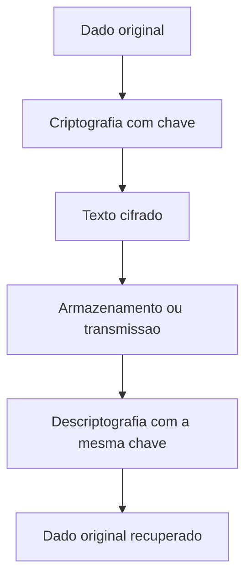

# Pesquisa - Segurança em PHP

**Integrantes:** Laura Cristina Gonçalves da Cruz, Otávio Giovanelli Biazzi, Pedro Henrique Miranda e Pedro Henrique Dalle Molle Godoi
**Série:** 2D  
**Curso:** Técnico em Informática Para Internet  
**Tema:** Funções para criptografia, hash, codificação e proteção de dados em PHP

## 1. Segurança em aplicações Web

Segurança da informação é o conjunto de práticas usadas para proteger dados contra acesso indevido, alteração, vazamento, perda ou uso incorreto. Em aplicações web, isso significa criar sistemas que preservem a confidencialidade, a integridade e a disponibilidade das informações dos usuários.

A proteção de dados é importante porque aplicações web geralmente lidam com informações sensíveis, como nomes, e-mails, senhas, endereços, dados escolares, dados financeiros e histórico de acesso. Se esses dados forem expostos, os usuários podem sofrer prejuízos, fraudes, invasões de conta ou roubo de identidade. A Autoridade Nacional de Proteção de Dados explica que a segurança da informação envolve ações para preservar confidencialidade, integridade e disponibilidade das informações, prevenindo ameaças digitais (ANPD, 2021).

Entre os principais riscos em aplicações desenvolvidas para a Internet estão:

- vazamento de senhas;
- acesso indevido a contas;
- SQL Injection;
- Cross-Site Scripting (XSS);
- Cross-Site Request Forgery (CSRF);
- sequestro de sessão;
- exposição de arquivos de configuração;
- uso de bibliotecas e versões desatualizadas;
- falhas de validação de entrada;
- transmissão de dados sem HTTPS.

O CERT.br recomenda que usuários e administradores tenham atenção com senhas, atualizações, conexões seguras e proteção contra golpes e ataques, pois esses cuidados reduzem riscos no uso de sistemas conectados à Internet (CERT.BR, 2024).

## 2. Criptografia, Hash e Codificação

Criptografia, hash e codificação são conceitos diferentes. Confundir esses termos pode causar erros graves, principalmente no armazenamento de senhas.

| Conceito | O que é | Tem volta? | Exemplo de uso |
|---|---|---|---|
| Criptografia | Técnica que transforma uma informação em um conteúdo ilegível usando chave. | Sim, se houver a chave correta. | Proteger um dado que precisa ser lido depois. |
| Hash | Função que transforma dados em um resumo de tamanho fixo. | Não, deve ser unidirecional. | Armazenar senhas de forma segura. |
| Codificação | Transformação de dados para outro formato de representação (ex: binário para texto). | Sim, sem chave secreta. | Converter dados binários para Base64. |

### Criptografia

Na criptografia, uma informação é embaralhada com uma chave. Depois, ela pode ser descriptografada com a chave correta. Isso é útil quando o sistema precisa guardar um dado protegido, mas ainda precisa recuperar o conteúdo original.

Exemplo de uso:

```text
Dados do usuario -> criptografia com chave -> texto cifrado
Texto cifrado -> descriptografia com chave -> dados do usuario
```

### Hash

O hash gera um resumo matemático de uma informação. Uma boa função de hash deve dificultar ao máximo descobrir o dado original a partir do hash. Para senhas, o PHP recomenda o uso de funções específicas como `password_hash()` e `password_verify()` (PHP DOCUMENTATION GROUP, 2026a; PHP DOCUMENTATION GROUP, 2026b).

Exemplo de uso:

```text
senha digitada -> password_hash() -> hash salvo no banco
senha no login -> password_verify() -> verdadeiro ou falso
```

### Codificação

Codificação não é proteção por si só. Ela apenas muda a forma de representar os dados. Base64, por exemplo, pode transformar dados binários em texto, mas qualquer pessoa pode decodificar esse conteúdo se tiver acesso a ele (PHP DOCUMENTATION GROUP, 2026d; PHP DOCUMENTATION GROUP, 2026e).

Exemplo de uso:

```text
imagem ou arquivo binario -> Base64 -> texto transportavel
```

## 3. Funções de Hash no PHP

O PHP possui funções para trabalhar com hashes. Algumas são próprias para senhas, e outras servem para gerar resumos de dados em situações gerais.

### password_hash()

A função `password_hash()` cria um hash seguro para senha. Ela já inclui recursos importantes, como o uso de algoritmo adequado e salt. O salt é incorporado ao hash gerado, então não é necessário criar uma coluna separada apenas para ele quando se usa essa função corretamente (PHP DOCUMENTATION GROUP, 2026a).

Exemplo:

```php
$hash = password_hash($senha, PASSWORD_DEFAULT);
```

Essa função deve ser usada no cadastro ou na troca de senha do usuário.

### password_verify()

A função `password_verify()` compara uma senha digitada com o hash salvo anteriormente. Ela retorna `true` se a senha corresponder ao hash e `false` caso contrário (PHP DOCUMENTATION GROUP, 2026b).

Exemplo:

```php
if (password_verify($senhaDigitada, $hashSalvo)) {
    echo "Login permitido";
}
```

Essa função deve ser usada no login, quando o usuário informa a senha e o sistema precisa verificar se ela está correta.

### hash()

A função `hash()` gera um hash usando algoritmos como `sha256`, `sha512` e outros. Ela pode ser útil para integridade de arquivos, assinaturas simples e comparação de resumos, mas não deve ser a escolha principal para guardar senhas de usuários (PHP DOCUMENTATION GROUP, 2026c).

Exemplo:

```php
$resumo = hash("sha256", "conteudo");
```

Para senhas, o mais adequado é usar `password_hash()` e `password_verify()`, porque essas funções foram feitas especificamente para esse caso.

### Algoritmos recomendados atualmente

Para senhas, recomenda-se usar algoritmos próprios para armazenamento de senha, como:

- `PASSWORD_DEFAULT`, para usar o padrão recomendado pelo PHP;
- `PASSWORD_BCRYPT`, opção muito usada e ainda aceita;
- `PASSWORD_ARGON2ID`, quando disponível no ambiente PHP.

Algoritmos rápidos como MD5 e SHA1 não devem ser usados para senhas. Eles são antigos e rápidos demais, o que facilita ataques de força bruta e uso de listas vazadas. A OWASP recomenda algoritmos próprios para senhas, como Argon2id, bcrypt, scrypt e PBKDF2, com parâmetros adequados de custo (OWASP, 2024a).

## 4. Funções de Codificação

### base64_encode()

A função `base64_encode()` codifica uma string usando Base64. Isso permite representar dados binários como texto, o que pode ser útil em transporte de dados, APIs, anexos, imagens embutidas ou tokens que precisam circular em formato textual (PHP DOCUMENTATION GROUP, 2026d).

Exemplo:

```php
$textoCodificado = base64_encode("Exemplo");
```

### base64_decode()

A função `base64_decode()` faz o processo inverso: transforma o texto em Base64 de volta para o conteúdo original (PHP DOCUMENTATION GROUP, 2026e).

Exemplo:

```php
$textoOriginal = base64_decode($textoCodificado);
```

### Por que Base64 não é criptografia?

Base64 não é criptografia porque não usa chave secreta e não tem a finalidade de esconder dados. Qualquer pessoa pode decodificar Base64 com ferramentas simples. Por isso, Base64 não deve ser usado para proteger senhas, dados pessoais, tokens secretos ou informações sensíveis.

Base64 é apenas uma forma de codificação. Ele pode ajudar no transporte de dados, mas não substitui criptografia, hash ou autenticação.

## 5. Criptografia no PHP

OpenSSL é uma biblioteca usada para operações criptográficas, como criptografia simétrica, criptografia assimétrica, certificados digitais e comunicação segura. No PHP, a extensão OpenSSL permite usar funções criptográficas diretamente no código (PHP DOCUMENTATION GROUP, 2026f).

No PHP, algumas funções relacionadas à criptografia com OpenSSL são:

| Função | Finalidade |
|---|---|
| `openssl_encrypt()` | Criptografa dados com um algoritmo e uma chave. |
| `openssl_decrypt()` | Descriptografa dados criptografados anteriormente. |
| `openssl_get_cipher_methods()` | Lista métodos de cifra disponíveis no ambiente. |
| `openssl_cipher_iv_length()` | Retorna o tamanho do IV necessário para uma cifra. |
| `openssl_random_pseudo_bytes()` | Gera bytes aleatórios, embora `random_bytes()` seja preferível em muitos casos modernos. |

Exemplo conceitual:

```php
$cipher = "aes-256-gcm";
$key = random_bytes(32);
$iv = random_bytes(openssl_cipher_iv_length($cipher));

$ciphertext = openssl_encrypt(
    $dados,
    $cipher,
    $key,
    OPENSSL_RAW_DATA,
    $iv,
    $tag
);
```

Em criptografia, não basta apenas chamar uma função. Também é necessário proteger a chave, usar algoritmos atuais, gerar IVs corretamente, evitar reutilização indevida de IV e preferir modos autenticados, como GCM, quando adequados. A chave nunca deve ficar exposta em código público ou no repositório.



## 6. Proteção de Senhas

Uma senha nunca deve ser salva em texto puro. Se o banco de dados for vazado, senhas em texto puro ficam imediatamente expostas. Isso é perigoso porque muitas pessoas reutilizam a mesma senha em vários serviços.

O armazenamento correto de senha deve seguir esta ideia:

```text
Cadastro:
senha do usuario -> password_hash() -> hash salvo no banco

Login:
senha digitada + hash salvo -> password_verify() -> resultado da verificacao
```

### O que é salt?

Salt é um valor aleatório adicionado ao processo de geração do hash. Ele impede que duas senhas iguais gerem exatamente o mesmo hash e dificulta ataques com tabelas prontas. Ao usar `password_hash()`, o PHP gera e armazena o salt dentro do próprio hash (PHP DOCUMENTATION GROUP, 2026a).

### O que torna um algoritmo de hash seguro?

Um algoritmo de hash para senha deve:

- ser feito especificamente para senhas;
- usar salt;
- permitir ajuste de custo;
- ser lento o suficiente para dificultar força bruta;
- ser resistente a ataques conhecidos;
- permitir atualização futura conforme a tecnologia evolui.

Por isso, `password_hash()` é mais indicado para senhas do que `hash("sha256", $senha)`. SHA-256 é útil para outras finalidades, mas não resolve sozinho os requisitos de armazenamento seguro de senhas.

## 7. Proteção contra Ataques

### SQL Injection

SQL Injection (injeção de SQL) acontece quando uma aplicação monta consultas SQL misturando comandos com dados digitados pelo usuário. Um atacante pode inserir trechos de SQL para alterar a consulta original, acessar dados indevidos, apagar registros ou burlar login.

Exemplo de risco:

```php
$sql = "SELECT * FROM usuarios WHERE email = '$email'";
```

Forma de prevenção:

- usar consultas preparadas;
- usar PDO ou MySQLi com parâmetros;
- validar entradas;
- limitar permissões do usuário do banco;
- não exibir erros SQL diretamente para o usuário.

A OWASP recomenda consultas parametrizadas como uma das principais formas de prevenir SQL Injection (OWASP, 2024b).

Exemplo com PDO:

```php
$stmt = $pdo->prepare("SELECT * FROM usuarios WHERE email = :email");
$stmt->execute(["email" => $email]);
```

### Cross-Site Scripting (XSS)

XSS ocorre quando um atacante consegue inserir código JavaScript malicioso em uma página acessada por outros usuários. Isso pode permitir roubo de sessão, redirecionamento, alteração visual da página ou captura de dados.

Formas de prevenção:

- escapar saídas com `htmlspecialchars()`;
- validar dados de entrada;
- evitar inserir dados do usuário diretamente no HTML;
- usar Content Security Policy (CSP);
- tratar corretamente atributos, URLs e JavaScript;
- marcar cookies de sessão como `HttpOnly`.

Exemplo:

```php
echo htmlspecialchars($nome, ENT_QUOTES | ENT_SUBSTITUTE, "UTF-8");
```

A OWASP destaca que a prevenção de XSS depende principalmente de codificação de saída correta, conforme o contexto em que o dado aparece na página (OWASP, 2024c).

### Cross-Site Request Forgery (CSRF)

CSRF acontece quando um usuário autenticado é induzido a executar uma ação sem perceber, como alterar senha, excluir conta ou fazer uma transferência. O navegador envia automaticamente cookies de sessão, e o servidor pode acreditar que a requisição foi legítima.

Formas de prevenção:

- usar tokens CSRF em formulários;
- validar o token no servidor;
- usar cookies com `SameSite`;
- exigir confirmação para ações sensíveis;
- verificar método HTTP adequado;
- evitar ações importantes via GET.

Exemplo conceitual:

```php
$_SESSION["csrf"] = bin2hex(random_bytes(32));
```

A OWASP recomenda o uso de tokens imprevisíveis e associados à sessão do usuário para prevenir CSRF (OWASP, 2024d).

## 8. Aplicações Práticas

### Sistemas de login

Sistemas de login usam `password_hash()` para armazenar senhas e `password_verify()` para autenticar usuários. Também precisam proteger sessões e impedir força bruta.

### Comércio eletrônico

Lojas virtuais lidam com dados pessoais, endereços, histórico de compras e pagamentos. Por isso, precisam de HTTPS, validação de entrada, proteção contra SQL Injection e boas práticas de sessão.

### Internet Banking

Internet Banking exige alto nível de proteção, pois envolve dinheiro e dados financeiros. Nesse tipo de sistema, criptografia, autenticação forte, registro de eventos e proteção contra ataques são indispensáveis.

### Redes sociais

Redes sociais armazenam perfis, mensagens, fotos e dados de acesso. XSS é um risco importante nesse contexto, porque usuários podem publicar conteúdo que será exibido para outras pessoas.

### Sistemas escolares

Sistemas escolares guardam notas, frequência, dados de alunos, professores e responsáveis. A proteção desses dados evita exposição de informações pessoais e alterações indevidas.

### Aplicativos de gerenciamento de usuários

Aplicações administrativas precisam controlar permissões, autenticação, sessão e auditoria. Nesses sistemas, falhas de segurança podem permitir acesso indevido a áreas restritas.
