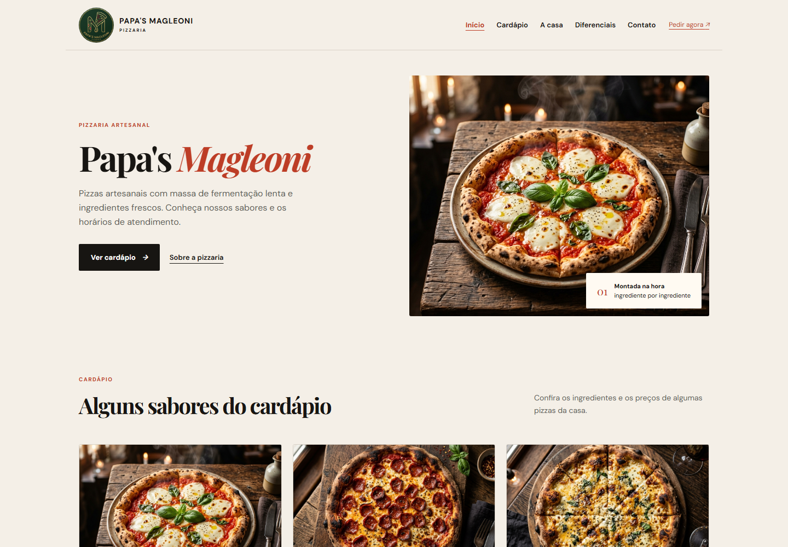
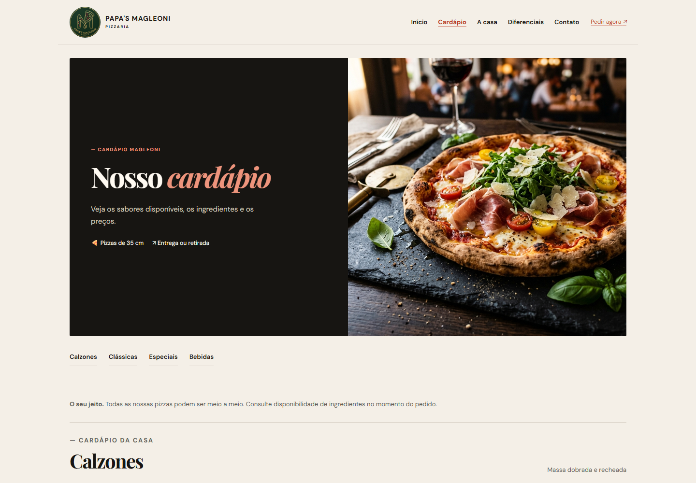

# Relatório do projeto Papa's Magleoni

**Instituição:** Etec Vasco Antônio Venchiarutti  
**Curso:** Desenvolvimento de Sistemas  
**Disciplina:** Sistemas Web (SWEB)  
**Turma:** 2º D — 3º bimestre  

**Integrantes:** Otávio Giovanelli Biazzi, Pedro Henrique Miranda, Laura Cristina Gonçalves da Cruz e Pedro Henrique Dalle Molle Godoi.

## Apresentação

Neste projeto, nós desenvolvemos um site para a pizzaria fictícia Papa's Magleoni. A proposta foi reunir uma página pública para os clientes e uma área administrativa capaz de manter os dados usados pelo site.

O código completo está no repositório [Papa-s-Magleoni](https://github.com/etecvav26-d206/Papa-s-Magleoni). Mantivemos este relatório dentro do portfólio de SWEB para registrar o que foi desenvolvido na disciplina e facilitar o acesso à entrega.

## Objetivo

Nosso objetivo foi aplicar os conteúdos de PHP estudados no bimestre em uma situação prática. O visitante consegue conhecer a pizzaria, consultar o cardápio e visualizar os depoimentos. Já a equipe responsável pelo estabelecimento possui uma área reservada para administrar essas informações.

## Parte pública do site

A página inicial apresenta a identidade visual da pizzaria, os destaques do cardápio e informações para contato. Também criamos uma página de cardápio para organizar as pizzas por categoria e facilitar a consulta do cliente.

### Página inicial

### Cardápio

