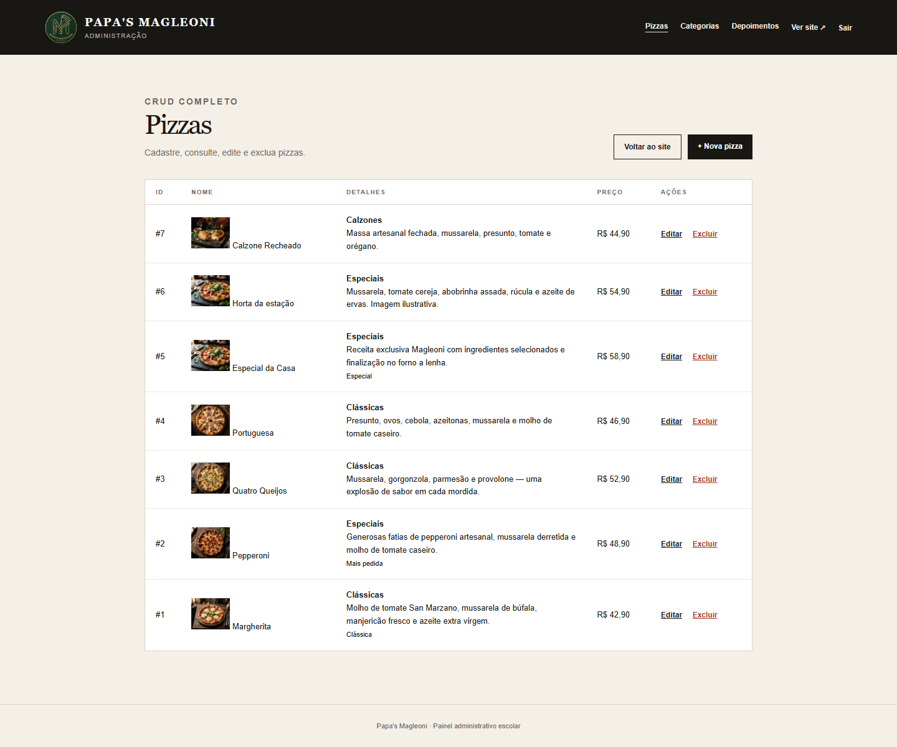
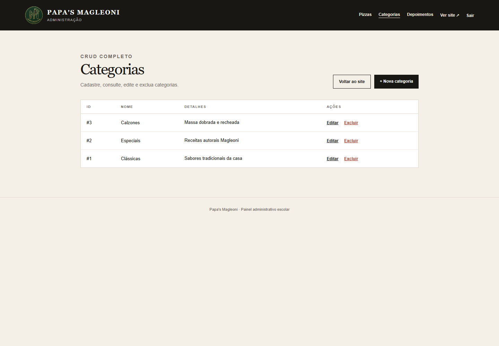
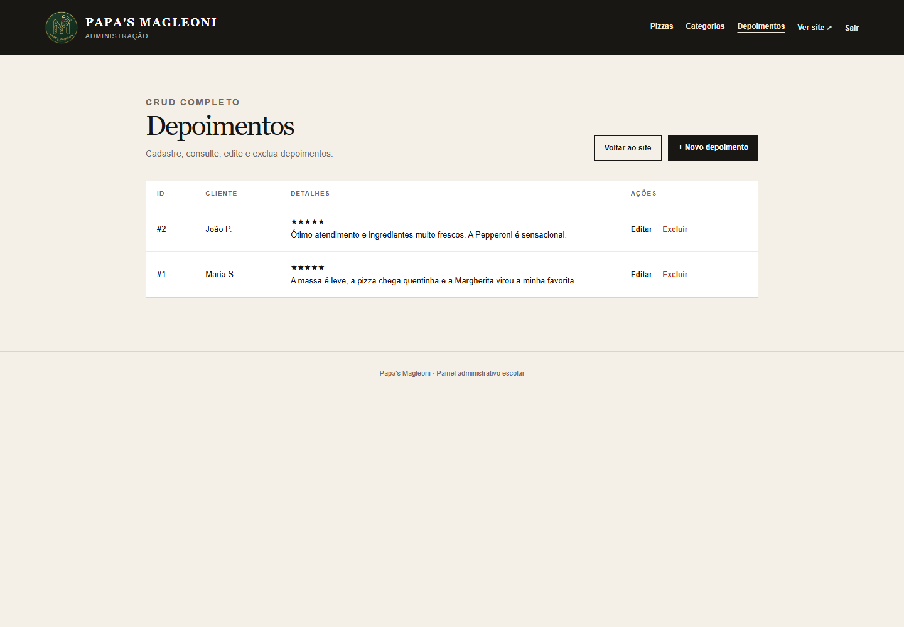

# Relatório do projeto Papa's Magleoni

**Instituição:** Etec Vasco Antônio Venchiarutti  
**Curso:** Desenvolvimento de Sistemas  
**Disciplina:** Sistemas Web (SWEB)  
**Turma:** 2º D — 3º bimestre  

**Integrantes:** Otávio Giovanelli Biazzi, Pedro Henrique Miranda, Laura Cristina Gonçalves da Cruz e Pedro Henrique Dalle Molle Godoi.

## Apresentação

Neste projeto, nós desenvolvemos um site para a pizzaria fictícia Papa's Magleoni. A proposta foi reunir uma página pública para os clientes e uma área administrativa capaz de manter os dados usados pelo site.

O código completo está no repositório [Papa-s-Magleoni](https://github.com/etecvav26-d206/Papa-s-Magleoni). Mantivemos este relatório dentro do portfólio de SWEB para registrar o que foi desenvolvido na disciplina e facilitar o acesso à entrega.

## Objetivo

Nosso objetivo foi aplicar os conteúdos de PHP estudados no bimestre em uma situação prática. O visitante consegue conhecer a pizzaria, consultar o cardápio e visualizar os depoimentos. Já a equipe responsável pelo estabelecimento possui uma área reservada para administrar essas informações.

## Parte pública do site

A página inicial apresenta a identidade visual da pizzaria, os destaques do cardápio e informações para contato. Também criamos uma página de cardápio para organizar as pizzas por categoria e facilitar a consulta do cliente.

### Página inicial

### Cardápio

## Banco de dados com PDO e MySQL

O sistema utiliza o MySQL para armazenar pizzas, categorias e depoimentos. A comunicação entre o PHP e o banco foi feita com PDO. Organizamos a conexão em um arquivo próprio e usamos consultas preparadas nas operações que recebem dados dos formulários.

O arquivo [`database.sql`](https://github.com/etecvav26-d206/Papa-s-Magleoni/blob/main/database.sql) contém a estrutura das tabelas e alguns registros iniciais. As categorias se relacionam com as pizzas, permitindo que o cardápio seja montado a partir dos dados cadastrados no painel.

## Área administrativa e os três CRUDs

Depois da autenticação, o administrador acessa as telas de gerenciamento. Em cada uma delas implementamos as quatro operações de um CRUD: cadastrar, listar, editar e excluir.

### CRUD de pizzas

O gerenciamento de pizzas permite informar nome, descrição, preço, categoria, imagem e disponibilidade. Esses dados aparecem no cardápio público quando o produto está disponível.

### CRUD de categorias

O cadastro de categorias organiza os tipos de pizza exibidos no cardápio. A tela permite criar novas categorias e alterar ou remover as existentes.

### CRUD de depoimentos

O terceiro CRUD administra os comentários apresentados na página inicial. Podemos cadastrar o nome do cliente, o texto do depoimento e controlar sua exibição.

## Segurança e organização

A área administrativa exige login e utiliza sessão para impedir o acesso direto às telas internas. Também aplicamos escape na saída dos dados e consultas preparadas no banco. A separação entre páginas públicas, painel, conexão e arquivos visuais deixou o projeto mais fácil de entender e manter.

O layout foi preparado para se adaptar a diferentes tamanhos de tela. Na parte pública, o menu, os cartões e as seções se reorganizam em telas menores; no painel, as tabelas continuam acessíveis com rolagem quando necessário.

## Testes realizados

Executamos o projeto localmente com PHP e MySQL, importamos o banco de dados e verificamos a página inicial, o cardápio e o login administrativo. Depois do acesso ao painel, conferimos as listagens dos três CRUDs e a comunicação com o banco. As imagens deste relatório foram capturadas durante essa verificação.

## Conclusão

O projeto nos ajudou a juntar interface, programação PHP e persistência de dados em uma aplicação completa. Na prática, entendemos melhor o caminho percorrido por uma informação: ela é preenchida no formulário, validada pelo sistema, gravada no MySQL por meio do PDO e depois apresentada novamente no site.

## Links da entrega

- [Repositório principal Papa-s-Magleoni](https://github.com/etecvav26-d206/Papa-s-Magleoni)
- [Relatório dentro do repositório principal](https://github.com/etecvav26-d206/Papa-s-Magleoni/blob/main/docs/RELATORIO-PROJETO.md)
- [Portfólio de Sistemas Web](https://github.com/etecvav26-d206/portifolio-sweb)
- [Análise das atividades de SWEB](../analise-github.md)
